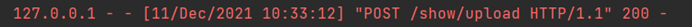

.. PhotoString documentation master file, created by
   sphinx-quickstart on Sun Dec 12 00:04:20 2021.
   You can adapt this file completely to your liking, but it should at least
   contain the root `toctree` directive.

Welcome to PhotoString's documentation!
=======================================

.. toctree::
   :maxdepth: 2
   :caption: Contents:

Lab2：Use blueprints to architect a web application
==============================================

小组成员信息： 

201932110143 王炫 

201932110145 邬程峰 

201932110146 吴彬宇

201932110147 吴雨桐 

201932110148 谢铭轩

项目Github地址：\ `Github <https://github.com/Steven-Yutong/PhotoString.git>`__

项目Read the Docs地址：\ `Read the Docs <https://photostring-yutong.readthedocs.io/zh/latest/>`__

`观看视频 <https://www.bilibili.com/video/BV1144y1E7Tc/>`__

`下载源码 <https://github.com/Steven-Yutong/PhotoString-Yutong/blob/master/docs/source/PhotoString.zip>`__

Abstract
--------

阅读和理解photo String现有的模块
(或类)和整体架构，借助工具对当前的架构进行优化，并在原项目基础上增加新功能。

Introduction
------------

本次项目是基于老师所给出的材料，一个名为photo
String的用于存储照片的网络相册。 改进后的Photo
String允许我们上传图片并为该图片添加名称，添加后的照片会显示照片本身，照片名称和添加照片时的日期、时间；
搜索功能允许用户通过照片名称搜索照片，只有那些描述匹配查询字符串的照片才会被返回；
我们添加了功能可以通过转跳至json界面返回api。

Materials and Methods
---------------------

Materials
~~~~~~~~~

Flask: 一个使用 Python 编写的轻量级 Web 应用程序框架。 Blueprint:
一个存储视图方法的容器。 Httpie:
一个命令行形式的http客户端，提供了简单的http命令，返回带代码高亮的结果信息。

Methods
~~~~~~~

使用Blueprint，在阅读逻辑处理源码、总结出PhotoString项目中各个模块方法的基础上，对原有项目进行模块化处理。
利用httpie，将上传到网页界面的图片信息以json格式展示。

Results
-------

文字
将原本Lab中的所有模块功能都细分到了show.py和api.py，并将这两个文件以蓝图形式在Lab.py这个主运行文件中注册。
在主运行文件中，默认路由会重定向到show_bp蓝图中的show方法并执行。

.. code:: python

   from flask import Flask, redirect, url_for
   from show import show_bp
   from api import api_bp

   app = Flask(__name__)

   # 将蓝图注册到app
   # 1.注册show蓝图
   # 2.注册api蓝图
   app.register_blueprint(show_bp, url_prefix="/show")
   app.register_blueprint(api_bp)

   # 自己本地的项目绝对路径
   ch = 'E:/JupyterWork/PhotoString_by_ChenXintao'

   # 在运行主界面后，会自动执行此方法
   @app.route('/', methods=['POST', 'GET'])
   def show():
       # url_for 获取 show_bp.show的url地址
       # redirect 重定向到目标地址
       return redirect(url_for('show_bp.show'))

   if __name__ == '__main__':
       app.run()
       app.run(debug=True)

在show.py文件中创建蓝图对象，并命名为“show_bp”

.. code:: python

   show_bp = Blueprint("show_bp", __name__)

在show.py下的show方法中，在源代码的显示界面的基础上增加了检索的表单。在程序启动后，网页会默认执行以下方法，将数据库中存储的所有图片以及检索图片功能、上传图片功能显示在网页上。

.. code:: python

   # show:显示方法
   @show_bp.route('/', methods=['GET', 'POST'])
   def show():
       # 显示两个表单: 上传表单和检索表单
       # 点击上传表单的submit，跳转到上传的路由执行相应方法
       # 点击检索表单的submit，跳转到检索的路由执行指定条件的检索方法
       page = '''
   <form action="/show/upload" method="post" enctype="multipart/form-data">
       <input type="file" name="file" />
       <input name="description" />
       <input type="submit"value="Upload" />
   </form>
   <form action="/show/search" method="post" enctype="multipart/form-data">
       <input type="text" name="search-str" />
       <input type="submit" value="检索" />
   </form>
   '''
       # 将数据库中的所有图片及其信息存到page中，输出到页面上
       page += get_database_photos()
       return page

show.py 下的上传文件（upload）方法的重构实现。

因为在单独的upload_bp中，点击upload按钮产生的post请求不能被upload_bp中的upload函数所接收，所以采用将upload函数放在show_bp中的方式，在点击upload按钮后，http产生Post命令，并被/show/upload接收，进入upload函数执行操作。

   图片

.. code:: python

   @show_bp.route("/upload", methods=['GET', 'POST'])#点击file跳转到/show/upload进行文件上传
   def upload():
       uploaded_file = request.files['file']#获取文件
       time_str = datetime.datetime.now().strftime('%Y%m%d%H%M%S')#获取时间
       new_filename = time_str + '.jpg'#将新文件名称命名为当前时间
       uploaded_file.save(ch + '/static/upload/' + new_filename)#将新文件以当前时间命名，保存至static/upload文件夹下
       time_info = datetime.datetime.now().strftime('%Y-%m-%d %H:%M:%S')#获取时间
       description = request.form['description']#获取文件名称
       path = ch + '/static/upload/' + new_filename#获取文件地址
       iq = InsertQuery(ch + '/static/RiskDB.db')#获取数据库地址
       iq.instructions("INSERT INTO photo Values('%s','%s','%s','%s')" % (time_info, description, path, new_filename))#将文件信息存入数据库
       iq.do()
       return '
You have uploaded %s.  <a href="/">Return</a>.' % (uploaded_file.filename)#显示文件upload成功，并增加返回show页面按钮。

检索功能已经整合在了主页面中，如果点击检索按钮，将会自动获取检索关键字search-str，并向数据库查询含有该关键字的项

.. code:: python

   # 获取数据库所有照片及其信息
   def get_database_photos(str = ''):
       rq = RiskQuery('./static/RiskDB.db')
       # sql语句:无检索特殊要求，默认检索所有图片
       if (str == ''):
           sql = "SELECT * FROM photo ORDER By time desc"
       # sql语句:有特殊检索要求:str, 以str为关键字检索所有与之相关的图片
       else:
           sql = "SELECT * FROM photo WHERE description LIKE '%" + str + "%' ORDER By time desc"
       rq.instructions(sql)
       rq.do()
       record = '
My past photo
'
       # 将读取到的sql语句转化为网页输出形式
       for r in rq.format_results().split('\n\n'):
           record += '%s' % (make_html_paragraph(r))
       return record + '</table>\n'

API使用get()方法，从数据库中读取图片信息。图片信息包括图片上传时间、图片描述、图片储存路径以及图片命名，再调用os.path.getsize方法，通过图片储存路径检索到该图片，从而获取图片大小。至此我们完成了图片信息的获取，再将信息存入数组完成get()方法。在api()中调用json.dumps方法将python对象转换成json对象。
在命令行调用http方法，打印该页面信息，即可查看已json数据类型的数据。

.. code:: python

   import json
   import os
   from UseSqlite import RiskQuery
   from flask import Blueprint

   api_bp = Blueprint("api_bp", __name__)

   @api_bp.route("/api/json", methods=['GET', 'POST'])
   def api():
       return json.dumps(get())  # 调用json.dumps方法将python对象转换成json对象

   # 获取图片信息
   def get():
       rq = RiskQuery('D:/2021.9Class/lan/PhotoString_by_ChenXintao/static/RiskDB.db')  # 数据库路径
       rq.instructions("SELECT * FROM photo ORDER By time desc")  # 读取数据表
       rq.do()
       data = []  # 定义空数组，用于存放图片信息
       for r in rq.format_results().split('\n\n'):
           lst = r.split(',')
           picture_time = lst[0].strip()  # 读取图片上传时间
           picture_desc = lst[1].strip()  # 读取图片描述
           picture_path = lst[2].strip()  # 读取图片储存路径
           picture_name = lst[3].strip()  # 读取图片命名
           picture_size = os.path.getsize(picture_path) // 1024  # 调用os.path.getsize方法获取图片大小
           js = {'picture_name': picture_name, 'picture_time': picture_time, 'picture_size': str(picture_size) +'KB', 'picture_desc': picture_desc}
           data.append(js)  # 将图片信息存入数组
       return data

Discussions
-----------

结构问题
~~~~~~~~

原先结构
^^^^^^^^

虽然使用了flask框架，程序轻量，但是关于程序的方法、逻辑实现、服务等所有内容都杂糅在Lab.py这一个文件中，逻辑混乱。若只是单人本地的练手项目倒不会有太大的问题，一个人进行代码开发、维护不会出现太大的问题；但若项目较大、需要多人协作开发，这样的项目结构很难对功能进行分工开发，并且只要有一个功能模块有错，整个程序都无法正常运行，每个小模块的测试都需要建立复杂的驱动模块；而若是项目后续需要有其他人接手进行小功能开发，他需要将整个项目全部阅读、理解才可以动工，大大影响效率。
其次，项目的注释非常少，这要求阅读源码的人员需要逐字逐句理解每一条语句的含义，大大影响工作效率。
再次项目的网页书写不规范，不仅仅是写在py文件中，而且网页格式也不符合html或是jsp的规范，稍有差错就会造成无法运行，且难以找到错误。

实验后
^^^^^^

首先用blueprint将项目的功能模块转移到其他.py文件中实现，并通过蓝图进行路由导航，对项目结构有一定程度的优化，也让项目利于维护。
其次对项目的主要逻辑实现部分添加了注释代码，增强了代码的可读性，每一个方法都注明了用途，方便后续接手人员的理解。
但由于水平有限，对于功能方法内的实现没有进行有效的重构，各个模块方法内有重复的逻辑，没有做到最好。

感悟
~~~~

在之后编写自己的python项目时，会尝试使用blueprint来对模块进行划分；在项目开发过程中，要把注释好好写起来，否则痛苦程度难以想象。

References
----------

1. `Sofia Peterson, How to Write a Computer Science Lab Report,
   Copyright©2019 <https://thehackpost.com/a-brief-guide-how-to-write-a-computer-science-lab-report.html#:~:text=A%20Brief%20Guide%20How%20to%20Write%20a%20Computer,Results.%20...%206%20Discussions.%20...%207%20References.%20>`__

2. `zhang8907xiaoyue,Python上传附件 flask.request.files(),
   Copyright©2018 <https://blog.csdn.net/zhang8907xiaoyue/article/details/81588922>`__

3. `汪凡, 蓝图(Blueprint)详解,
   Copyright©2021 <https://www.cnblogs.com/wf-skylark/p/9306789.html>`__

4. `枫林夕阳, Flask蓝图（Blueprint）使用方式解析,
   Copyright©2016 <https://www.jianshu.com/p/95b584e4f76e>`__

5. `慕城南风, python之蓝图blueprint浅析,
   Copyright©2020 <https://blog.csdn.net/lovedingd/article/details/106690903#:~:text=%E4%B8%80%E3%80%81python%E4%B8%AD%E7%9A%84%E8%93%9D%E5%9B%BE%20%E7%AE%80%E5%8D%95%E6%9D%A5%E8%AF%B4%EF%BC%8CBlueprint,%E6%98%AF%E4%B8%80%E4%B8%AA%E5%AD%98%E5%82%A8%E8%A7%86%E5%9B%BE%E6%96%B9%E6%B3%95%E7%9A%84%E5%AE%B9%E5%99%A8%EF%BC%8C%E8%BF%99%E4%BA%9B%E6%93%8D%E4%BD%9C%E5%9C%A8%E8%BF%99%E4%B8%AABlueprint%20%E8%A2%AB%E6%B3%A8%E5%86%8C%E5%88%B0%E4%B8%80%E4%B8%AA%E5%BA%94%E7%94%A8%E4%B9%8B%E5%90%8E%E5%B0%B1%E5%8F%AF%E4%BB%A5%E8%A2%AB%E8%B0%83%E7%94%A8%EF%BC%8CFlask%20%E5%8F%AF%E4%BB%A5%E9%80%9A%E8%BF%87Blueprint%E6%9D%A5%E7%BB%84%E7%BB%87URL%E4%BB%A5%E5%8F%8A%E5%A4%84%E7%90%86%E8%AF%B7%E6%B1%82%E3%80%82>`__

6. `DragonFangQy, Flask初探五( Blueprint / url_for / endpoint ),
   Copyright©2018 <https://blog.csdn.net/f704084109/article/details/80867726>`__

7. `HTTPie, HTTPie 2.6.0 文档,
   Copyright©2012-21 <https://httpie.io/docs#windows>`__

8. `你若盛开清风自来_, Python中的json操作,
   Copyright©2018 <https://blog.csdn.net/weixin_40636692/article/details/81212304?ops_request_misc=%257B%2522request%255Fid%2522%253A%2522163905887716780265483694%2522%252C%2522scm%2522%253A%252220140713.130102334..%2522%257D&request_id=163905887716780265483694&biz_id=0&utm_medium=distribute.pc_search_result.none-task-blog-2~all~sobaiduend~default-2-81212304.first_rank_v2_pc_rank_v29&utm_term=python+json&spm=1018.2226.3001.4187>`__
